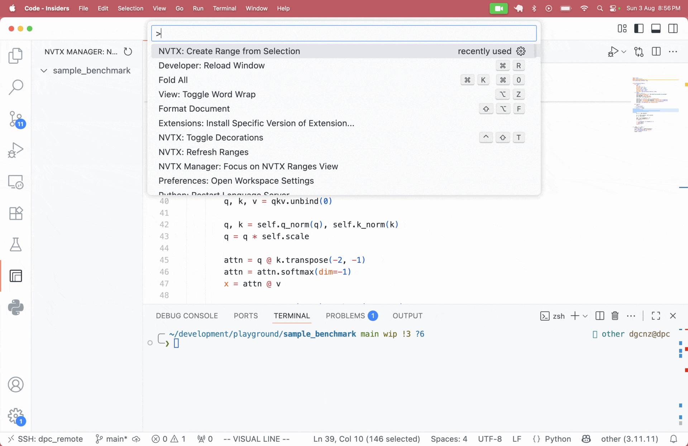

# NVTX Range Manager

<p align="center">

</br>

<p align="center">
 
</p>
</p>


VS Code extension for creating NVIDIA NVTX profiling ranges in Python code. Mark regions visually, then profile with NVIDIA Nsight Systems without modifying source files.

## Features

- **Visual Range Creation**: Select Python code in VS Code and instantly create NVTX profiling ranges
- **Persistent Range Management**: Ranges are saved in your workspace and can be enabled/disabled as needed
- **Code Decorations**: Visual indicators clearly mark range boundaries in your editor
- **Non-Intrusive Profiling**: Transform code at runtime without modifying source files
- **Standalone CLI Tool**: Profile code independently using the `njkt` command-line tool
- **Seamless Integration**: Works with PyTorch's CUDA NVTX bindings and NVIDIA Nsight Systems
- **Context Manager Injection**: Automatically wraps marked regions with `torch.cuda.nvtx.range` statements

## Quick Start

1. **Install the VS Code extension** from the marketplace
2. **Install the CLI tool** for code transformation and execution on your script's workspace:
   ```bash
   # Using uv (recommended)
   uv add git+https://github.com/dgcnz/nvtx-vscode.git#subdirectory=py
   
   # Or using pip
   pip install git+https://github.com/dgcnz/nvtx-vscode.git#subdirectory=py
   ```
3. **Create profiling ranges**: Select Python code in VS Code and run "NVTX: Create Range from Selection"
4. **Execute with profiling**: Run your transformed code:
   ```bash
   njkt your_script.py
   ```
5. **Profile with NVIDIA tools**:
   ```bash
   nsys profile njkt your_script.py
   ```

## Requirements

- **Python 3.9+** with PyTorch (CUDA support required for GPU profiling)
- **NVIDIA Nsight Systems** for profiling execution
- **VS Code 1.87.0+** for the extension
- **`njkt` CLI tool** (installed separately via pip/uv)

## Architecture

The project consists of two main components:

- **VS Code Extension** (`src/`): Provides the visual interface for creating and managing NVTX ranges
- **Python CLI Tool** (`py/`): Handles code transformation and execution with NVTX profiling
  - Install: `uv add git+https://github.com/dgcnz/nvtx-vscode.git#subdirectory=py`
  - Usage: `njkt script.py` (automatically reads `.vscode/nvtx_ranges.json`)

## CLI Usage

The `njkt` command-line tool transforms and executes your Python code with NVTX profiling:

```bash
# Basic execution with default ranges
njkt your_script.py

# Pass arguments to your script
njkt train.py --batch-size 32 --lr 0.001

# Use custom ranges file
njkt --ranges custom_ranges.json script.py

# Debug transformation (output transformed code)
njkt --transform-only --output transformed.py script.py

# Full profiling pipeline
nsys profile njkt script.py
```